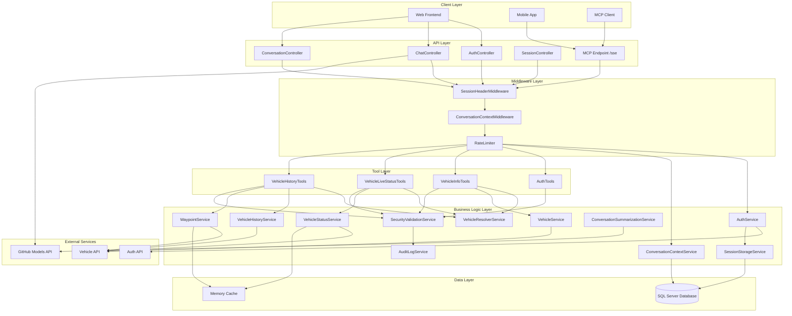
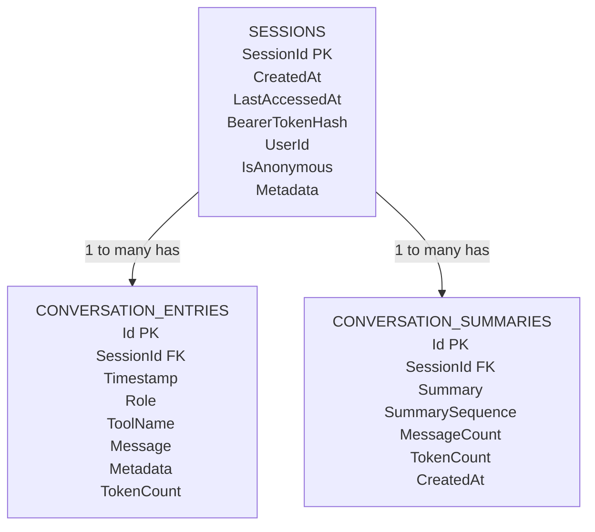
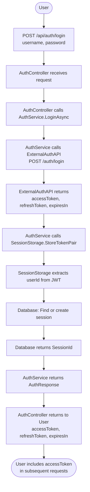
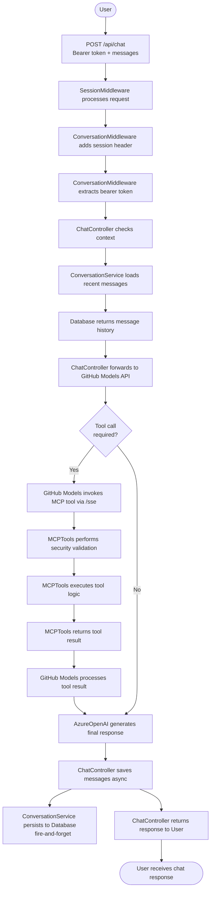
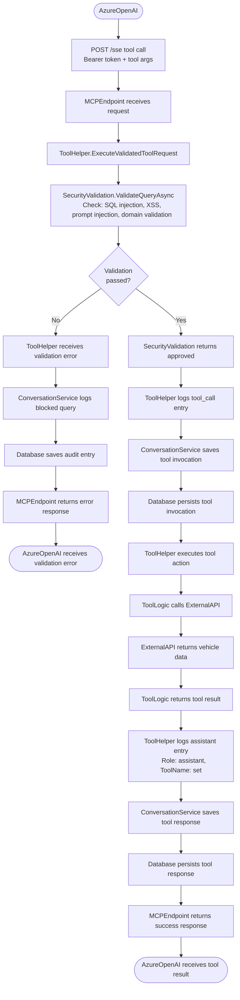
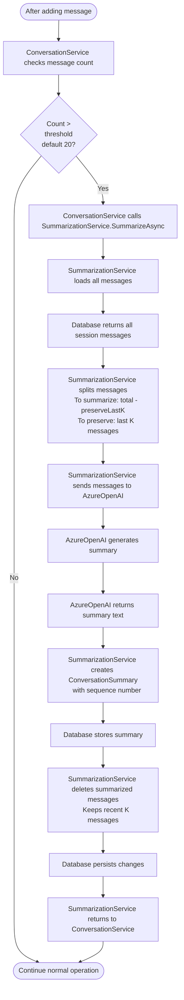
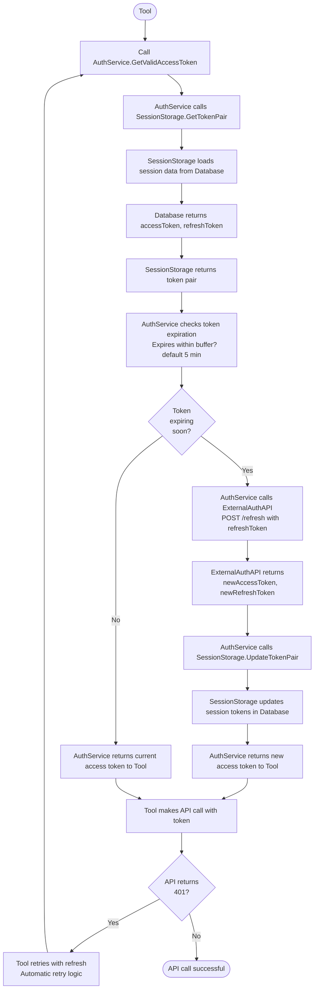
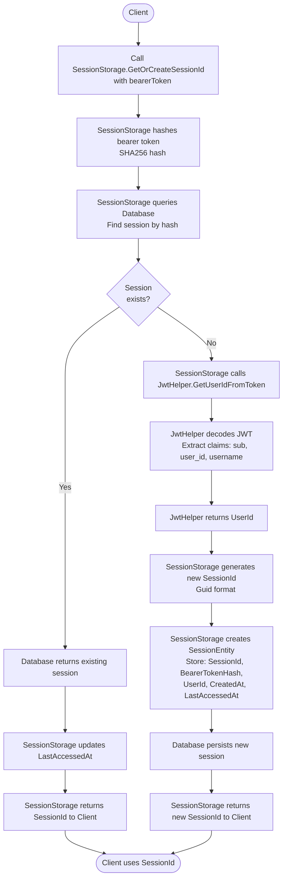

# Architecture Documentation

Technical architecture documentation for the MCP Server for Vehicle Fleet Management.

## System Overview



## Layer Architecture

### 1. Client Layer
- **Web Frontend** - HTML/CSS/JS SPA (in wwwroot/)
- **Mobile Apps** - External mobile clients
- **MCP Clients** - Model Context Protocol compatible clients

### 2. API Layer (Controllers)
- **AuthController** - JWT authentication endpoints
- **ChatController** - Chat proxy to Azure OpenAI
- **ConversationController** - Conversation history management
- **SessionController** - Session lifecycle management
- **MCP Endpoint** - Server-Sent Events for tool invocations

### 3. Middleware Layer
- **SessionHeaderMiddleware** - Injects/validates session IDs
- **ConversationContextMiddleware** - Extracts bearer tokens
- **RateLimitingMiddleware** - Enforces rate limits

### 4. Business Logic Layer (Services)
- **Authentication & Sessions**
  - AuthService, SessionStorageService, JwtHelper
- **Vehicle Operations**
  - VehicleResolverService, VehicleService, VehicleStatusService, VehicleHistoryService, WaypointService
- **Conversation**
  - ConversationContextService, ConversationSummarizationService
- **Security**
  - SecurityValidationService, AuditLogService

### 5. Tool Layer
- AuthTools, VehicleInfoTools, VehicleLiveStatusTools, VehicleHistoryTools
- All use standardized `ExecuteValidatedToolRequestWithContextAsync` pattern

### 6. Data Layer
- **SQL Server** - Primary database (sessions, messages, summaries)
- **File-based Audit Log** - Security events logged to ./logs/audit.log
- **Memory Cache** - Caching for waypoints and vehicle data

### 7. External Services
- **GitHub Models API** - Chat completions and summarization (via Azure.AI.OpenAI SDK)
- **Vehicle API** - External vehicle data provider
- **Auth API** - External authentication service

---

## Database Schema



### Table Descriptions

#### Sessions
Stores user session information and maps bearer tokens to conversation contexts.

**Indexes:**
- `PK_Sessions` on `SessionId`
- `IX_Sessions_LastAccessedAt` on `LastAccessedAt`
- `IX_Sessions_BearerTokenHash` on `BearerTokenHash` (filtered, non-null only)

**Relationships:**
- One-to-many with ConversationEntries (cascade delete)
- One-to-many with ConversationSummaries (cascade delete)

#### ConversationEntries
Stores individual conversation messages and tool invocations.

**Indexes:**
- `PK_ConversationEntries` on `Id`
- `IX_ConversationEntries_SessionId_Timestamp` on `SessionId`, `Timestamp`

**Role Values:**
- `user` - User messages
- `assistant` - AI responses (final answers)
- `tool_call` - Tool invocation records

**Notes:**
- Assistant messages with `ToolName` set are tool responses (filtered from UI)
- Token count tracked per message for budget management

#### ConversationSummaries
Stores AI-generated conversation summaries.

**Indexes:**
- `PK_ConversationSummaries` on `Id`
- `IX_ConversationSummaries_SessionId` on `SessionId`
- `UQ_ConversationSummaries_SessionId_Sequence` on `SessionId`, `SummarySequence` (unique)

**Notes:**
- SummarySequence increments for each new summary (1, 2, 3...)
- Maximum 2 summaries kept per session (configurable)
- Old messages deleted after summarization

---

## Key Flows

### 1. User Authentication Flow



**Steps:**
1. User submits credentials to `/api/auth/login`
2. AuthService calls external authentication API
3. Receives JWT tokens (access + refresh)
4. SessionStorageService extracts userId from JWT
5. Creates or updates session in database with token hash
6. Returns tokens to user
7. User includes accessToken in subsequent requests

---

### 2. Message Processing Flow



**Steps:**
1. User sends chat message with bearer token
2. SessionHeaderMiddleware ensures session ID present
3. ConversationContextMiddleware extracts bearer token
4. ChatController loads conversation context
5. Proxies request to Azure OpenAI
6. If tool call needed, OpenAI invokes MCP tool via `/sse`
7. Tool executes after security validation
8. Tool result returned to OpenAI
9. OpenAI generates final response
10. User and assistant messages saved to database (async)
11. Response returned to user

---

### 3. Tool Execution Flow



**Steps:**
1. Azure OpenAI calls MCP tool via `/sse`
2. ToolExecutionHelper validates security
3. Checks for dangerous patterns and domain relevance
4. If validation fails:
   - Logs to audit log
   - Returns error to OpenAI
5. If validation succeeds:
   - Logs tool invocation (role: tool_call)
   - Executes tool business logic
   - Calls external vehicle API
   - Logs tool response (role: assistant, with toolName)
   - Returns result to OpenAI

---

### 4. Conversation Summarization Flow



**Steps:**
1. After each message, check message count
2. If count exceeds threshold (default 20):
   - Load all messages from database
   - Split into "to summarize" and "to preserve" (last K)
   - Send messages to GitHub Models API for summarization
   - Receive concise summary text
   - Save as ConversationSummaryEntity with sequence number
   - Delete old messages from database
   - Keep recent K messages for continuity
3. Next chat request includes summary in context

---

### 5. Token Refresh Flow



**Steps:**
1. Tool requests valid access token from AuthService
2. AuthService loads token pair from SessionStorage
3. Checks token expiration time
4. If expiring within buffer (5 minutes):
   - Calls external API to refresh token
   - Receives new access and refresh tokens
   - Updates SessionStorage and database
   - Returns new token
5. If still valid, returns current token
6. Tool uses token for API call
7. If API returns 401, automatic retry with fresh token

---

### 6. Session-to-User Mapping Flow



**Steps:**
1. Client makes authenticated request with bearer token
2. SessionStorageService hashes token (SHA256)
3. Queries database for session with matching hash
4. If session exists:
   - Returns existing SessionId
   - Updates LastAccessedAt timestamp
5. If session doesn't exist:
   - Extracts UserId from JWT claims
   - Generates new SessionId (GUID)
   - Creates SessionEntity in database
   - Returns new SessionId
6. Session persists across requests and server restarts

---

## Component Responsibilities

### Controllers (API Layer)
- **Input validation** - Validate request parameters and bodies
- **Authentication** - Verify bearer tokens (except auth endpoints)
- **Routing** - Map HTTP requests to service methods
- **Response formatting** - Transform service results to HTTP responses
- **Error handling** - Catch exceptions and return appropriate status codes

### Services (Business Logic Layer)
- **Business rules** - Implement domain logic and validation
- **External API calls** - Communicate with vehicle and auth APIs
- **Data transformation** - Map between DTOs and domain models
- **Caching** - Cache frequently accessed data (waypoints, vehicle info)
- **Token management** - Handle JWT lifecycle and refresh
- **Security validation** - Enforce guardrails and threat detection

### Tools (MCP Layer)
- **Parameter extraction** - Parse MCP tool arguments
- **Security delegation** - Use ToolExecutionHelper for validation
- **Domain logic** - Implement vehicle tracking operations
- **Response formatting** - Format results for AI consumption
- **Conversation tracking** - Log tool calls and responses

### Data Layer
- **Persistence** - Store and retrieve entities
- **Migrations** - Database schema versioning
- **Relationships** - Enforce foreign key constraints
- **Indexes** - Optimize query performance
- **Cascade deletes** - Clean up related data

---

## Security Architecture

### Authentication Flow
1. User credentials → External Auth API
2. JWT tokens returned (access + refresh)
3. Bearer token in `Authorization` header
4. Token mapped to session in database
5. Session contains userId for audit trail

### Authorization
- Bearer token required for all endpoints (except `/api/auth/*`)
- Rate limiting by token hash (anonymous per-token tracking)
- Session-based access to conversation data
- No role-based access control (RBAC) currently implemented

### Security Validation (Query Guardrails)
- **Pattern Detection**:
  - SQL injection patterns
  - XSS patterns
  - Command injection patterns
  - Prompt injection patterns
- **Domain Validation**:
  - Tool queries must match declared domain
  - Educational queries blocked
  - Off-topic queries blocked
- **AI Guardrails** (optional):
  - GitHub Models API validates query intent
  - Contextual threat analysis
  - Fallback to pattern matching if AI unavailable

### Audit Logging
- File-based audit log (`./logs/audit.log`)
- Blocked queries logged with:
  - UserId
  - Tool name
  - Reason for blocking
  - Query preview (truncated)
  - Timestamp
- Automatic log rotation (10MB max, 5 files)
- Configurable retention (default 7 days)

---

## Performance Considerations

### Caching Strategy
- **WaypointService**: Caches decompressed waypoints (sliding expiration)
- **VehicleStatusService**: Caches vehicle status data (configurable TTL)
- **SessionStorage**: In-memory cache of token pairs

### Database Optimization
- Indexes on frequently queried columns
- Composite indexes for multi-column queries
- Filtered indexes (e.g., BearerTokenHash non-null only)
- Cascade deletes reduce manual cleanup queries

### Async Operations
- Message persistence (fire-and-forget)
- Summarization triggered async
- Token refresh in background
- Audit logging non-blocking

### Rate Limiting
- Sliding window algorithm
- Per-token partitioning
- No queueing (immediate rejection at limit)
- Separate limits for tools (60/min) and conversation API (10/min)

---

## Configuration Management

### appsettings.json Structure
```json
{
  "ApiSettings": {
    "VehicleStatusUrl": "External API endpoints",
    "TokenRefreshBuffer": 300,
    "MaxRetryAttempts": 2
  },
  "ConversationContext": {
    "WindowSize": 10,
    "MaxTokens": 8000,
    "SummaryThreshold": 20
  },
  "ConnectionStrings": {
    "DefaultConnection": "SQL Server connection"
  },
  "Audit": {
    "RetentionDays": 7
  }
}
```

### Environment Variables
- `OPENAI_API_KEY` - Required for summarization and AI guardrails
- `DEFAULT_CONNECTION` - Alternative to appsettings.json connection string

### Design-Time vs Runtime
- **Design-Time**: ConversationDbContextFactory reads appsettings.json for migrations
- **Runtime**: ConversationDbContextFactory injected via DI with connection string
